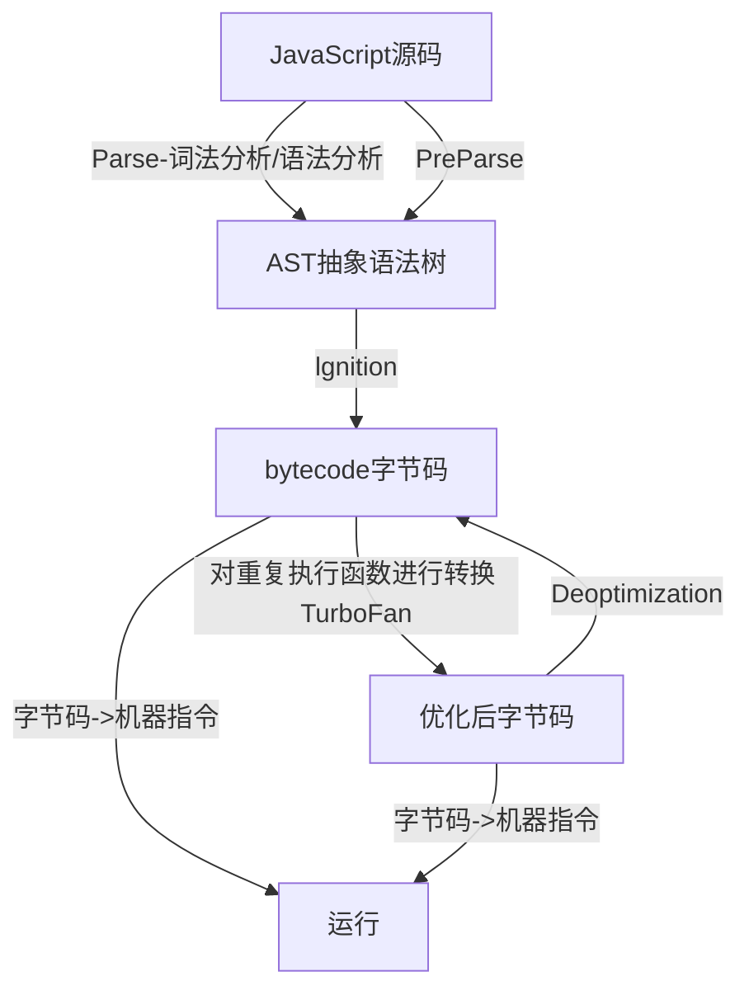

## javascript是一门编程语言
1.JavaScript是一门高级的编程语言
2.编程语言发展阶段：
	a. 机器语言
	b. 汇编语言
	c. 高级语言

## 浏览器工作原理（渲染过程）
1. 请求获取html文件，解析html文件获取DOM树（下载JS，JS操作DOM通过JS引擎解析执行）
2. 请求CSS文件，解析CSS,结合DOM树获取渲染树
3. 对渲染树进行绘制展示

浏览器内核：包含JavaScript引擎和web解析引擎
JavaScript引擎：将JavaScript高级语言转换为机器语言（CPU指令）
v8引擎：JavaScript引擎的一种，google开发的 当前主流JavaScript引擎
## v8引擎解析js流程

PreParse:预解析，对于不是开始就会执行的代码，对不必要的函数进行预解析，只解析需要的内容
Deoptimization:js弱类型语言会出现特殊情况例如参数数字相加，字符串相加逻辑不同，返回字节码重新执行

### 代码运行过程
1. Parse：解析代码，创建GO（globalObject ）全局对象,包含window(指向GO自身),String,Date,Object等，以及代码中声明的变量（变量提升）
2. 执行代码，v8引擎内部存在一个执行上下文栈（ECS，Exection Context Stack）(函数调用栈)
3. 为了全局代码执行 ，需要创建全局执行上下文（GEC, Global Exection Context）